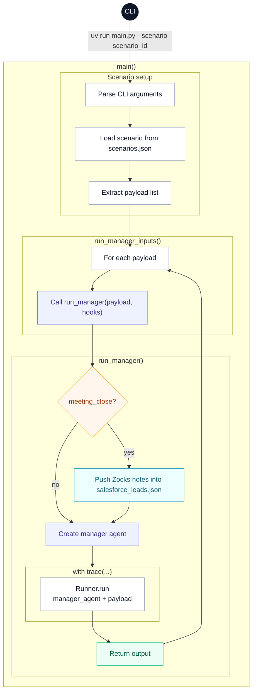

# First Command Hackathon

Agentic prototype and hackathon assignment for the First Command financial onboarding workflow. The repo models how Salesforce notifications, inbound client emails, document processing, advisor assignment, meeting scheduling, and post-meeting follow-up can be orchestrated through a manager agent and a set of specialist agents.

## Hackathon Context

This repository is intended to be completed as a hackathon assignment rather than used as a finished production system. Parts of the workflow are already wired together, while other pieces are intentionally scaffolded and still need to be implemented or refined.

- Read through the [README.md](README.md) to get an understanding of the project.
- Walk through the assignment checklist in [TODO.md](TODO.md). Use that file as the step-by-step guide for which agents, guardrails, evals, and API validation tasks still need to be completed.
- Run scenarios listed in [SCENARIOS.md](SCENARIOS.md) for testing and evaluation.
- Use [EXAMPLES.md](EXAMPLES.md) as a cheat-sheet to reference key code snippets.

## What This Repository Does

This project simulates a lead-to-client workflow driven by AI agents:

- New-lead intake from Salesforce notifications.
- Existing-client and duplicate screening before a lead is routed.
- Advisor assignment based on state, branch path, and advisor fit.
- Inbound email processing for client replies, attachments, and follow-up intent.
- Attachment OCR and document classification, including compliance-aware routing.
- Meeting scheduling when a client explicitly confirms availability.
- Post-meeting follow-up using Zocks meeting summaries and action items.
- Outreach for missing Form 1500 fields and next-step planning.

The external systems are mocked locally through JSON files under `data/`, so the workflow can be exercised end-to-end without real Salesforce, email, Laserfiche, or Zocks dependencies.

## Key Documents

- `README.md`: Project overview and high-level architecture.
- `TODO.md`: Step-by-step directions to build the project and progress through the hackathon, including a reference list of available components (agents, tools, guardrails).
- `SCENARIOS.md`: Categorized lists of scenarios that can be run using `uv run main.py --scenario [scenario_id]` for test-drive development and evaluation.
- `EXAMPLES.md`: Cheat-sheet reference material containing example code for key concepts (pydantic, agents, tools, guardrails).
- `data/README.md`: Expanded data definitions for the mock JSON databases.

## Architecture

Core components:

- `main.py`: CLI entrypoint for scenario runs and custom payload execution.
- `api.py`: FastAPI wrapper around the same `run_manager()` path used by the CLI.
- `custom_agents/manager.py`: top-level router that decides which specialist agent to invoke.
- `custom_agents/lead_reviewer.py`: qualifies new leads, screens duplicates/existing clients, and assigns advisors.
- `custom_agents/response_ingestion.py`: processes inbound emails, updates Salesforce, schedules meetings, and routes attachments.
- `custom_agents/infotrack.py`: handles missing-information outreach and post-meeting follow-up based on advisor availability and Zocks notes.
- `tools/salesforce.py`: mocked Salesforce record access, lead updates, advisor lookup, document upload, and meeting scheduling.
- `tools/emails.py`: mocked inbound email reader and outbound email sender.
- `tools/document_processor.py`: attachment OCR/extraction plus compliance classification with cached results in `data/cache/`.
- `tools/laserfiche.py`: mocked Laserfiche uploader for compliance-relevant documents.
- `tools/zocks.py`: mocked meeting-note updater and reviewer for post-meeting actions.
- `guardrails/`: confidence, moderation, prompt-injection, topic, PII, and document-classification guardrails.
- `utils.py`: tracing, telemetry summaries, and trace bundle persistence.
- `evals/` and `evals.py`: convert saved traces into an eval dataset and launch OpenAI eval runs.

## Prerequisites

- Python `3.14`
- `uv`
- `OPENAI_API_KEY` in `.env`

Example `.env`:

```bash
OPENAI_API_KEY=your_key_here
```

## Setup

1. Install dependencies:

```bash
uv sync
```

2. Ensure `.env` is present with a valid OpenAI API key.

3. If you want to restore the mock runtime state manually, run:

```bash
uv run scripts/reset_runtime_data.py
```

Note: `main.py` restores the top-level runtime JSON files in `data/` from their `*_original.json` copies on startup. Because `api.py` imports `main.py`, starting the API also resets that runtime state.

## Running The Workflow

List the available scenarios:

```bash
uv run main.py --list-scenarios
```

Run the default end-to-end scenario:

```bash
uv run main.py --scenario e2e_test
```

Run a different predefined scenario:

```bash
uv run main.py --scenario corrupted_attachment
```

Run a custom payload JSON:

```bash
uv run main.py --payload path/to/payload.json
```


### Supported Payload Types

Defined in `data/scenarios.json`:

- `salesforce_notification`
  - Required fields: `UID`, `salesforce_notification_id`, `salesforce_trigger_type`
  - Supported trigger types: `new_lead`, `meeting_close`
- `inbound_email`
  - Required fields: `email_id`

### Zocks Meeting Notes

When the `main.py` loop detects a `meeting_close` payload, a helper script grabs the zocks meeting summary and zocks action items from the payload and adds them to the latest scheduled meeting associated with the UID. In this manner, we emulate Zocks automatically pushing summaries and action items to Salesforce when a meeting wraps up.

## API

Start the API locally:

```bash
uv run uvicorn api:app --reload
```

Interactive docs:

- `http://localhost:8000/docs`

Endpoints:

- `GET /`: health check
- `POST /agents/run`: execute the workflow for a single payload

Example request:

```bash
curl -X POST "http://localhost:8000/agents/run" \
  -H "accept: application/json" \
  -H "Content-Type: application/json" \
  -d '{
    "payload_type": "salesforce_notification",
    "UID": "UID-2026-0201",
    "salesforce_notification_id": "NOTIF-2026-0201",
    "salesforce_trigger_type": "new_lead"
  }'
```

The API response includes the structured manager output along with the resolved `trace_id` and `session_id`.

## Data and Runtime State

Key files and folders:

- Scenarios:
  - `data/scenarios.json`: scenario definitions and payload-type metadata used by the CLI.
- Inbound Payloads:
  - `data/emails.json`: mocked inbound email records keyed by `email_id`.
  - `data/salesforce_notifications.json`: mocked Salesforce notification records.
  - `data/sample_input/`: sample email attachements used by document-processing scenarios.
- Salesforce Records:
  - `data/salesforce_leads.json`: mocked lead records used by the Salesforce tools.
  - `data/salesforce_clients.json`: mocked client records.
  - `data/salesforce_advisors.json`: advisor profiles and availability inputs.
- Laserfiche:
  - `data/laserfiche.json`: mocked Laserfiche upload state.

Since the workflow mutates the runtime JSON files during execution, all data files have an `*_original.json` version. Running the CLI or API resets JSON files back to their preserved originals (at the start of every workflow `*.json` is replaced by `*_original.json`).

For a full walkthrough of the data model, file relationships, schemas, and reset/editing rules, see `data/README.md`.

## Tracing and Evals

Trace files are written to `traces_logs/trace_*.json`.

Run evals:

```bash
uv run python evals.py
```

The eval job (`evals/eval_agents.py`) converts trace files into a JSONL dataset and launches an OpenAI eval run.

## Tests

This repo currently includes a `unittest`-style test module in `tests.py`.

Run it with:

```bash
uv run python -m unittest tests.py
```

## Main Loop: `main.py`

Note that rather than directly call `Runner.run(...)` in the main function call, `main.py` uses some additional control logic to load scenarios and pass the associated data for each payload to the starting agent (in this case, manager). This also allows us to utilize *hooks* to pass summary data between agent calls.



## Utility Scripts

Flatten a PDF to an image-based PDF so the model must use OCR to extract text (rather than reading embedded text directly from the PDF):

```bash
uv run python pdf_to_image_only_pdf.py --input [input_filepath] --output [output_filepath]
```
